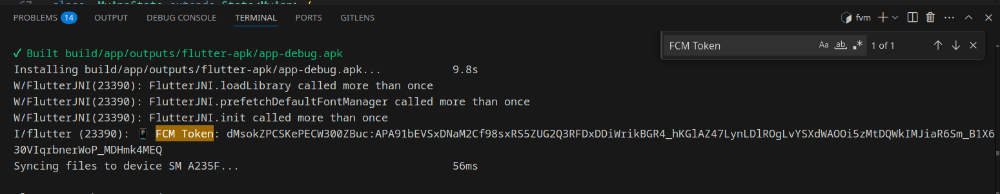

# 📱 Hello Notification Flutter

A minimal Flutter app that receives push notifications using **Firebase Cloud Messaging (FCM)**. Built to work seamlessly with the paired Spring Boot backend from the `hello-notification` project.

---

## 🚀 Features

- Firebase Cloud Messaging (FCM) support
- Minimal setup for learning push notification flow
- Works with custom Spring Boot backend (trigger via `/api/events/trigger`)

---

## 🛠️ Setup Guide

### 1. Prerequisites

- Flutter installed (using FVM recommended)
- Firebase Project (configured via Firebase Console)
- Android device or emulator
- Spring Boot backend running locally

---

### 2. Create Flutter Project (via FVM)

```bash
fvm flutter create hello_notification_flutter
cd hello_notification_flutter
```

### 3. Add Firebase to Flutter

#### a. Add Firebase project via Firebase Console

- Click Add app → Android
- Package name: com.example.hello_notification_flutter (or your custom one)
- Download google-services.json after setup


### b. Place google-services.json

```bash
mv ~/Downloads/google-services.json android/app/
```

### 4. Update android/build.gradle

Add the following at the bottom:

```bash
classpath 'com.google.gms:google-services:4.4.0' // Inside dependencies block
```

### 5. Update android/app/build.gradle

- Add plugin at the top:

```bash
    apply plugin: 'com.google.gms.google-services'
```

- Add dependencies:

```bash
dependencies {
  implementation 'com.google.firebase:firebase-messaging:23.4.0'
}
```

### 6. Add Permissions in AndroidManifest.xml

```bash
Location: android/app/src/main/AndroidManifest.xml
```

```xml
<manifest xmlns:android="http://schemas.android.com/apk/res/android"
    package="com.example.hello_notification_flutter">

    <!-- Required for FCM -->
    <uses-permission android:name="android.permission.INTERNET"/>
    <uses-permission android:name="android.permission.POST_NOTIFICATIONS"/>

    <application
        android:label="hello_notification_flutter"
        android:name="${applicationName}"
        android:icon="@mipmap/ic_launcher">
        ...
    </application>
</manifest>
```

### 7. Add FCM Flutter Plugin

In pubspec.yaml:

```yml
dependencies:
  firebase_core: ^2.27.0
  firebase_messaging: ^14.7.6
```

Then run:

```bash
fvm flutter pub get
```

### 8. Initialize Firebase & Request Notification Permissions

In your main Dart file (lib/main.dart):

```dart
import 'package:flutter/material.dart';
import 'package:firebase_core/firebase_core.dart';
import 'package:firebase_messaging/firebase_messaging.dart';
import 'package:flutter_local_notifications/flutter_local_notifications.dart';

final FlutterLocalNotificationsPlugin flutterLocalNotificationsPlugin =
    FlutterLocalNotificationsPlugin();

const AndroidNotificationChannel channel = AndroidNotificationChannel(
  'channel_id', // Replace with your channel ID
  'channel_name', // Replace with your channel name
  description: 'This channel is used for important notifications.',
  importance: Importance.high,
);

Future<void> _firebaseMessagingBackgroundHandler(RemoteMessage message) async {
  await Firebase.initializeApp();
  print('Handling a background message: ${message.messageId}');
}

void main() async {
  WidgetsFlutterBinding.ensureInitialized();

  try {
    await Firebase.initializeApp();
  } catch (e) {
    print('Error initializing Firebase: $e');
  }

  FirebaseMessaging.onBackgroundMessage(_firebaseMessagingBackgroundHandler);

  const AndroidInitializationSettings initializationSettingsAndroid =
      AndroidInitializationSettings('@mipmap/ic_launcher');

  final InitializationSettings initializationSettings = InitializationSettings(
    android: initializationSettingsAndroid,
  );

  try {
    await flutterLocalNotificationsPlugin.initialize(initializationSettings);
  } catch (e) {
    print('Error initializing local notifications: $e');
  }

  try {
    await flutterLocalNotificationsPlugin
        .resolvePlatformSpecificImplementation<
            AndroidFlutterLocalNotificationsPlugin>()
        ?.createNotificationChannel(channel);
  } catch (e) {
    print('Error creating notification channel: $e');
  }

  // Optional: Print token for testing
  FirebaseMessaging messaging = FirebaseMessaging.instance;
  final token = await messaging.getToken();
  print('📱 FCM Token: $token');

  runApp(MyApp());
}

class MyApp extends StatefulWidget {
  @override
  State<MyApp> createState() => _MyAppState();
}

class _MyAppState extends State<MyApp> {
  @override
  void initState() {
    super.initState();

    FirebaseMessaging.onMessage.listen((RemoteMessage message) {
      RemoteNotification? notification = message.notification;
      AndroidNotification? android = message.notification?.android;

      if (notification != null && android != null) {
        try {
          flutterLocalNotificationsPlugin.show(
            notification.hashCode,
            notification.title,
            notification.body,
            NotificationDetails(
              android: AndroidNotificationDetails(
                channel.id,
                channel.name,
                channelDescription: channel.description,
                importance: Importance.max,
                priority: Priority.high,
                icon: '@mipmap/ic_launcher',
              ),
            ),
          );
        } catch (e) {
          print('Error showing notification: $e');
        }
      }
    });
  }

  @override
  Widget build(BuildContext context) {
    return MaterialApp(
      home: Scaffold(
        appBar: AppBar(title: Text('Hello Notification')),
        body: Center(child: Text('FCM Ready ✅')),
      ),
    );
  }
}
```

### 9. Run the App

```bash
fvm flutter run
```

## ✅ Test FCM Notifications

- Collect FCM Token from console

- Add the token in spring boot application.properties
- Launch your Spring Boot backend
- Trigger push notification:

```bash
curl -X POST http://localhost:8080/api/events/trigger
```

If the Flutter app is running on a physical or emulator device, you should see the notification.